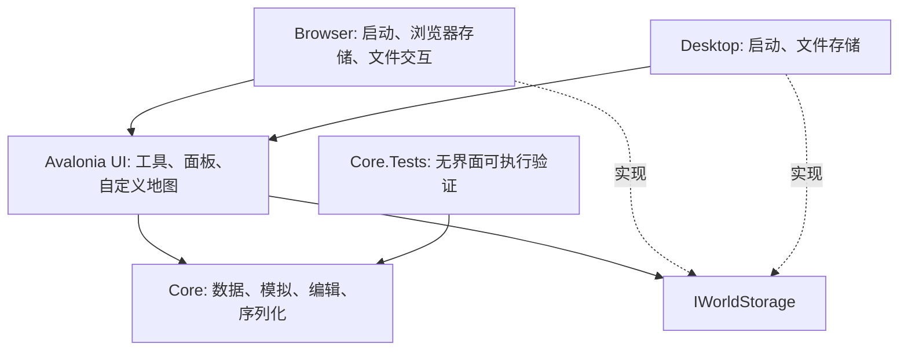

# SeWZC.WorldBox 架构与开发边界

## 目标与当前阶段

以 Avalonia + C# 实现可在桌面及浏览器运行的 2D 上帝沙盒。当前交付可编辑、观察、保存的古代文明原型，包含个体认知、实体通信与文化／研究／魔法／建设的基础闭环，并通过 GitHub Pages 静态交付。长期目标包括文明演化、战争、多种幻想种族、天灾、国家与文明编辑，以及科技和魔法共存。

当前系统以可理解的模拟闭环为优先级，经济与战争使用简化规则；不把原型功能等同于完整文明模拟。每项扩展需要回答：其状态如何进入存档、如何影响已有系统、玩家如何观察结果，以及它对浏览器执行预算的影响。

## 依赖方向

`Core` 不引用 Avalonia、浏览器 API 或桌面文件系统，可以独立执行与验证。`UI` 通过平台接口保存、加载、导入和导出世界。平台入口处理生命周期与具体存储机制。

目前把模拟与其内容定义放在同一个核心项目，应用协调留在 UI。等模块规模需要时，再拆分独立的 `Content` 与 `Application` 项目，避免提前建立没有使用场景的通用引擎层。

## 世界数据

世界使用定长地格数组与具有稳定 ID 的居民、聚落、国家、军队等集合。地格包含地形、肥力、归属与局部灾害状态；居民包含种族、年龄、职业、位置与国家 / 聚落归属。聚落库存是资源的权威来源，国家资源总量属于聚合展示。

首批种族为人类、精灵、矮人和兽人。种族差异可以影响寿命、需求或生产，但不等于永久敌对阵营。国家通过人口、聚落与领土组织模拟。文化由独立 ID 与合作、创新、自然亲和等价值构成，居民、聚落和国家分别保存认同；当面接触可积累文化影响。改变国家文化不会瞬间改写每个居民的认同。

在已有国家领土投放居民会加入该国的聚落，包括不同种族。当前国家编辑器可修改名称、不透明旗色、资源库存、外交以及 1–5 级古代发展水平；发展水平属于古代阶段的编辑参数，不等同于聚落已经完成所有本地研究，也不包含未来科技树。

当前概念的区分如下：

| 概念 | 负责的状态 |
| --- | --- |
| 种族 | 生理需求、寿命、栖息偏好、固有能力 |
| 文化 | 独立认同、价值与接触传播；完整传统和宗教体系尚未实现 |
| 国家 | 制度、政策、外交、军事与领土；研究及公开知识在聚落本地保存 |
| 居民 | 个体身份、生活需求、文化认同和国家归属 |

## 模拟与呈现

模拟按离散时间推进，更新独立于渲染。暂停不改变世界时间；提高速度表示推进更多模拟步，不能用提高屏幕帧率替代。对性能不足的设备，应降低实际模拟推进速度并保留规则，而不是跳过饥饿或战争结果。

经济使用聚落库存及居民随身库存：劳动、进食与交付必须满足位置条件，运输有实体携带过程，建设与研究消耗材料。道路影响真实通行成本；设施由到场居民建设及运作。领土扩张、战争和灾害通过同一世界状态相互影响。当前行为、贸易与战斗仍为简化算法，海运、复杂道路规划和战术阵型属于后续范围。

居民通过需求、人格、职业和自己的消息记录选择目标。消息记录包含观察与获知时间、原始来源、转述者、职业、可信度及转述次数；居民看到的信息与世界事实分开保存。当面交流经待投递队列处理，信使和商旅需实际移动。制度使用已递送报告，并按身份和议题相关性加权，不能直接扫描全国居民思想。政策及研究成果也需要实际传播。

通信科技解锁不代表全球即时连通。信号塔需要运作、覆盖聚落并形成无阻挡连接；未接入或失联时依赖实体携带。文化、研究、设施、道路与魔法均进入同一存档，核心因果测试验证它们对库存、行动、生产、知识及战斗的实际影响。魔法恢复受地区环境影响，施法受天赋、训练、魔力与范围限制。

世界事件记录发生的变化，国家决策说明来自当前模拟规则。事件文本不依赖在线模型，浏览器离线运行也能够解释已有状态。记录有界：世界事件最多 400 条并按重要程度保留，居民记忆最多 16 条、决策 6 条、个人经历 24 条，亡者档案最多 256 位；这些不是无限的人生档案。当前战争由玩家外交编辑宣战触发，军队按实际获知的军令行动；尚未实现自主外交宣战。

地图是一个自定义 Avalonia 控件，绘制地形、领土、居民、聚落和效果，不给每个地格创建独立 UI 控件。镜头缩放与平移属于呈现状态，地格坐标属于模拟状态；输入需通过同一坐标变换进行命中判断。地形采用分块缓存，实体按可见区域绘制。实体运动使用呈现时间在真实逻辑位置间插值，不推进模拟或消耗随机数；暂停冻结，载入及编辑传送重置，跟随只改变镜头。

初期采用单线程 WebAssembly，不依赖 `SharedArrayBuffer`、跨源隔离或专有服务器配置。未来若引入后台线程或专门渲染器，需保留能在普通静态托管上运行的路径。

## 编辑与存档

地形修改不仅改变颜色，还要维护通行、实体位置和领土归属。国家编辑同样必须维护实体引用。领土笔刷覆盖聚落时，会使用与军事占领共用的转移逻辑，维护居民、聚落、国家和首都关系；拥有至少两处聚落的国家可通过聚落独立创建新国家。

玩家编辑会自动暂停，并保留这一轮编辑前的完整世界快照。撤销恢复整个快照；恢复模拟后清除恢复点，防止只回滚地形却留下已发生的历史变化。当前仅有一个会话内恢复点，不提供逐笔多级撤销或通用事务日志。编辑转移、拆分以及异常参数通过核心验证覆盖。

居民档案编辑统一验证后写入，结构化经历可调整未来性格，记忆可改变未来选择；文字本身不会被当成指令执行，也不会重算过去的资源、死亡或战争。查看档案与筛选日志只读世界状态。

JSON 存档包含格式版本、世界种子、模拟时间、随机数状态以及实体 ID 与关系。使用源生成序列化上下文，降低发布裁剪对浏览器反射序列化的影响。导入需要检查尺寸、集合上限、枚举、数值和关系，失败时保留当前世界。

确定性目标是：相同程序版本、相同世界状态与相同操作序列得到相同结果。恢复存档后应延续同一随机数序列。它不是跨硬件、跨框架或跨版本完全相同浮点行为的保证。Alpha 阶段允许破坏存档与接口兼容，不提供旧格式迁移；旧格式被拒绝时需新建世界，同一当前格式的保存恢复及非法输入拒绝仍是必须满足的要求。

浏览器使用站点本地 IndexedDB，桌面使用本地应用数据目录下的文件，通过同目录临时文件替换避免写入中断破坏原存档。导入 / 导出上限为 32 MiB，导出文件作为用户可携带的备份。隐藏页面时暂停，恢复可见后继续，不进行离线补算。定期保存比仅在页面关闭时保存可靠，浏览器并不保证关闭事件能执行异步写入。

## 静态交付

浏览器项目使用 `Microsoft.NET.Sdk.WebAssembly`，发布后的 `wwwroot` 是完整静态站点。脚本把它复制到 `artifacts/site`，增加 `.nojekyll` 并检查引用与 WebAssembly 载荷。入口、脚本与样式采用相对 URL，使根目录和 `/SeWZC.SandboxGame/` 等项目子路径均可使用。

GitHub Actions 固定 SDK，安装 `wasm-tools`，构建桌面与浏览器项目，运行核心验证程序，再发布静态文件。随后使用 Node.js 22 和固定版本 Playwright，在本地 HTTP 服务的 `/SeWZC.SandboxGame/` 子路径运行 Chromium 桌面、触屏与运动检查。桌面及触屏检查使用只读语义控件快照定位实际控件，再派发真实鼠标、键盘或触摸事件，并从真实 IndexedDB／导出文件核对结果。快照仅在 `?e2e=1` 时启用，不提供编辑或推进世界的测试命令。截图、存档样本与日志作为构建产物保留；所有分支和 PR 都执行验证，只有 `alpha` 分支的推送或手动运行通过后才由独立部署任务使用最小 Pages 权限发布。该条件不依赖仓库默认分支。

首次部署前，仓库所有者需要把 Pages 的 Source 配置为 GitHub Actions，并确保 `github-pages` 环境的分支策略允许 `alpha`。部署任务先通过 `actions/configure-pages` 检查站点配置，再用 `actions/deploy-pages` 发布已验证的静态产物，不写入 `gh-pages` 分支。部署后用实际站点 URL 重跑同样三套浏览器检查并保留证据。

静态检查可以发现缺失资源、错误根路径和未替换的指纹占位符，不能替代实际浏览器启动与交互检查。发布流程不添加不必要的服务器、认证或网络依赖。

## 验证策略与路线图

核心验证关注模拟规则与持久化结果：相同种子的生成、存档后的连续演化、无效输入拒绝、编辑后的实体一致性，以及经济、灾害和战争的实际影响。桌面和浏览器共用核心，但仍分别需要平台启动验证。

浏览器重点验证实际发布目录与仓库子路径、资源加载、中文显示、笔刷与缩放、保存恢复、导入导出、页面隐藏行为和手机尺寸布局。真实手机、多个浏览器、长时间运行、人口压力和帧预算应形成持续的验收记录。

| 阶段 | 交付边界 |
| --- | --- |
| 当前原型 | 地形、四种族、个体认知、实体消息、文化政策、局部研究、建设道路、基础魔法、陆战灾害与存档 |
| 古代文明完善 | 生产 / 运输 / 补给、政治、战争与灾害平衡，更完整的因果观察工具 |
| 规模与交互 | 持续测量 256×256 和约 2,000 居民，优化真机触控、缓存、存档与长时间运行 |
| 社会扩展 | 更丰富的文化、制度、外交与国家分裂规则，增加有边界且可解释的交互 |
| 科技与奇幻 | 后续时代、科技帝国、完整魔法路线及融合内容 |

目前关闭魔法发展时，阻止新的奥术研究、秘法设施建设与训练；已有设施、已学知识和能力保留，已有施法者仍可施法。更多路线开关需明确区分新的发展与已有能力。“彻底移除某体系”是独立世界转换操作，不能作为普通开关的隐含行为。尚未实现的模块不提供可启用的占位开关。

本次构建的检查结果及尚未验证的范围见 [验证记录](verification.md)。
