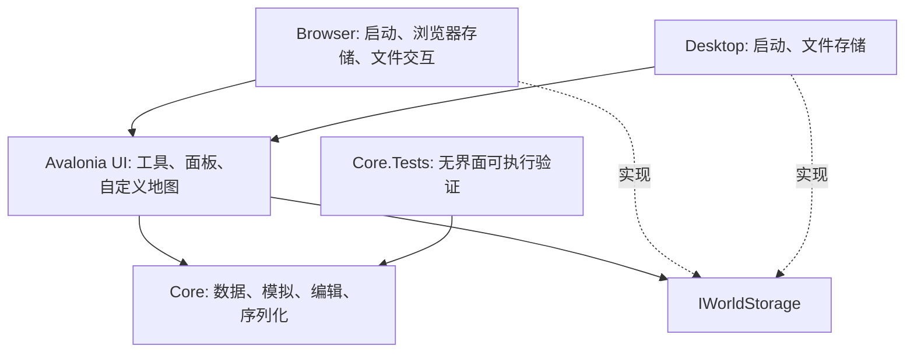

# SeWZC.WorldBox 架构与开发边界

本文描述当前模块与状态边界。产品行为见 [产品约定](product.md)，选择这些结构的原因及重新评估条件见 [设计决策](decisions/README.md)，修改与验证流程见 [开发约定](development.md)。容量、权重及布局数量是当前实现参数，不是永久产品要求。

## 目标与当前阶段

以 Avalonia + C# 实现可在桌面及浏览器运行的 2D 上帝沙盒。当前交付可编辑、观察、保存的文明原型，从古代起步并支持未来制造与高阶魔法的首批研究／生产路线，包含个体认知、实体通信与文化／研究／魔法／建设的基础闭环，并通过 GitHub Pages 静态交付。文明演化、有限战争、幻想种族、天灾与国家编辑已具备基础机制；后续继续完善深度、平衡与规模。

当前系统以可理解的模拟闭环为优先级，经济与战争使用简化规则；不把原型功能等同于完整文明模拟。每项扩展需要回答：其状态如何进入存档、如何影响已有系统、玩家如何观察结果，以及它对浏览器执行预算的影响。

## 依赖方向

`Core` 不引用 Avalonia、浏览器 API 或桌面文件系统，可以独立执行与验证。`UI` 通过平台接口保存、加载、导入和导出世界。平台入口处理生命周期与具体存储机制。

目前把模拟与其内容定义放在同一个核心项目，应用协调留在 UI。等模块规模需要时，再拆分独立的 `Content` 与 `Application` 项目，避免提前建立没有使用场景的通用引擎层。

## 世界数据

世界使用定长地格数组与具有稳定 ID 的居民、聚落、国家、军队等集合。地格包含地形、肥力、归属与局部灾害状态；居民包含种族、年龄、职业、位置与国家 / 聚落归属。聚落库存是资源的权威来源，国家资源总量属于聚合展示。

首批种族为人类、精灵、矮人和兽人。种族差异可以影响寿命、需求或生产，但不等于永久敌对阵营。国家通过人口、聚落与领土组织模拟。文化由独立 ID 与合作、创新、自然亲和等价值构成，居民、聚落和国家分别保存认同；当面接触可积累文化影响。改变国家文化不会瞬间改写每个居民的认同。

在已有国家领土投放居民会加入该国的聚落，包括不同种族。当前国家编辑器可修改名称、不透明旗色、资源库存、外交以及 1–5 级古代发展水平；发展水平属于古代阶段的编辑参数，不等同于聚落已经完成所有本地研究，高级研究另由聚落的科技／魔法路线保存。

当前概念的区分如下：

| 概念 | 负责的状态 |
| --- | --- |
| 种族 | 生理需求、寿命、栖息偏好、固有能力 |
| 文化 | 独立认同、价值与接触传播；完整传统和宗教体系尚未实现 |
| 国家 | 制度、政策、外交、军事与领土；研究及公开知识在聚落本地保存 |
| 居民 | 个体身份、生活需求、文化认同和国家归属 |

## 模拟与呈现

模拟按离散时间推进，更新独立于渲染。暂停不改变世界时间；提高速度表示推进更多模拟步，不能用提高屏幕帧率替代。对性能不足的设备，应降低实际模拟推进速度并保留规则，而不是跳过饥饿或战争结果。

经济使用聚落库存及居民随身库存：劳动、进食与交付必须满足位置条件，运输有实体携带过程，建设与研究消耗材料。道路影响真实通行成本；设施由到场居民建设及运作。领土扩张、战争和灾害通过同一世界状态相互影响。当前行为、贸易与战斗仍为简化算法，海运、复杂道路规划和战术阵型属于后续范围。

当地规划与住房扩张共享待发展项目的材料预算。规划保留原有项目优先顺序，但跳过暂时无法支付的可选项目，并核对研究前置条件；住房为下一项项目保留木材、石材。设施目标通过现有 `AgentGoal.TargetEntityId` 保存建筑 ID，到场执行时使用同一目标，不能因为旁边还有设施就改变产物。工坊按当地原料的实际产率判断岗位及采集来源；这些选择不增加独立随机源或改变存档格式。

居民通过需求、人格、职业和自己的消息记录选择目标。消息记录包含观察与获知时间、原始来源、转述者、职业、可信度及转述次数；居民看到的信息与世界事实分开保存。当面交流经待投递队列处理，信使和商旅需实际移动。制度使用已递送报告，并按身份和议题相关性加权，不能直接扫描全国居民思想。政策及研究成果也需要实际传播。

目标候选与通信临时容器由引擎复用，不进入存档。通信在每个阶段从当前居民与位置重建 ID 查询和地格链表，邻居仍按居民 ID 排序；阶段结束释放临时居民引用。到期消息保持原顺序递送，未来消息保持原队列顺序。新观察或已经复制的递送快照可以直接交给接收者的记忆，共享证据仍需独立复制，不能让不同居民共享可变知识。资源搜索按距离先检查近处候选，利用当前合法产出上界剪枝，并保留半径六的可见范围及同分时原地格顺序；修改产出评分或肥力上限时必须同步检查剪枝上界。

`WorldEngine.WorkQueries.cs` 在死亡归档之后、居民行动之前，按聚落重建建筑与居民的临时查询组，并复用组容器。患者健康、位置、建筑完工状态和工作名额仍即时读取对象；同一行动阶段发生迁居时同步更新居民分组。阶段结束通过 `finally` 清空组内引用，外部劳动命令直接查询当前权威集合，因而编辑、建造、删除和导入不依赖过期缓存。后续若在居民行动阶段新增建筑或其他归属变更路径，也须维护这些临时分组。

居民局部绕路保留方向顺序与六步搜索边界；四方向、深度六的搜索最多访问 85 个地格，队列使用这个有界缓冲，访问标记使用地图长度的整数数组及每次搜索的新编号。编号到达整数上限时清空标记；这些缓冲不进入存档，也不消耗世界随机数。256×256 地图的访问标记约 256 KiB，队列约 1 KiB；提高搜索深度或增加方向时须重新计算容量。障碍边缘的四方向选择使用直接循环，保留原来的平分顺序与避免回退规则。

通信科技解锁不代表全球即时连通。信号塔需要运作、覆盖聚落并形成无阻挡连接；未接入或失联时依赖实体携带。文化、研究、设施、道路与魔法均进入同一存档，核心因果测试验证它们对库存、行动、生产、知识及战斗的实际影响。魔法恢复受地区环境影响，施法受天赋、训练、魔力与范围限制。

世界事件记录发生的变化，国家决策说明来自当前模拟规则。事件文本不依赖在线模型，浏览器离线运行也能够解释已有状态。记录有界：世界事件最多 400 条并按重要程度保留，居民记忆最多 16 条、决策 6 条、个人经历 24 条，亡者档案最多 256 位；这些不是无限的人生档案。自主外交在 `WorldEngine.Evolution.cs` 中读取首都收到的接触／贸易消息和本地状态；结盟提议、宣战通知与前线军令经实体通信传递。迁徙实际抵达后提交归属，分裂依据收到的困苦报告。玩家外交编辑仍是显式全局干预。

界面将地图工具、详情导航和规则窗口分开。工具与详情默认收起；手机二者互斥。数值和对象表单由 `MainView.Inputs.cs` 提供，世界规则由 `MainView.Rules.cs` 提供，地图预览与只读校验由 `WorldMapControl.Tools.cs` 和核心共享校验实现。建筑赐予与材料施工经过同一位置、归属和容量检查，赐予只跳过材料与施工等待。

地图是一个自定义 Avalonia 控件，绘制地形、领土、居民、聚落和效果，不给每个地格创建独立 UI 控件。镜头缩放与平移属于呈现状态，地格坐标属于模拟状态；输入需通过同一坐标变换进行命中判断。地形采用分块缓存，实体按可见区域绘制。实体运动使用呈现时间在真实逻辑位置间插值，不推进模拟或消耗随机数；暂停冻结，载入及编辑传送重置，跟随只改变镜头。

初期采用单线程 WebAssembly，不依赖 `SharedArrayBuffer`、跨源隔离或专有服务器配置。未来若引入后台线程或专门渲染器，需保留能在普通静态托管上运行的路径。

## 编辑与存档

地形修改不仅改变颜色，还要维护通行、实体位置和领土归属。国家编辑同样必须维护实体引用。领土笔刷覆盖聚落时，会使用与军事占领共用的转移逻辑，维护居民、聚落、国家和首都关系；拥有至少两处聚落的国家可通过聚落独立创建新国家。

玩家编辑会自动暂停，并保留这一轮编辑前的完整世界快照。撤销恢复整个快照；恢复模拟后清除恢复点，防止只回滚地形却留下已发生的历史变化。当前仅有一个会话内恢复点，不提供逐笔多级撤销或通用事务日志。编辑转移、拆分以及异常参数通过核心验证覆盖。

居民档案编辑统一验证后写入，结构化经历可调整未来性格，记忆可改变未来选择；文字本身不会被当成指令执行，也不会重算过去的资源、死亡或战争。查看档案与筛选日志只读世界状态。

当前格式版本与模拟版本为 7，包含世界规则、聚落发展及不满状态、外交接触／提议／冷却、有限战争及已收战报、事件／经历关联、项目采样、进阶物资、生产批次、地块改造、矿藏和载具运输。外交关系保存 `FirstOpinion`／`SecondOpinion` 两个方向的态度，`Opinion` 仅保存其展示均值；军队保存 `LastOrderTick`／`LastOrderFactId`，以免换帅或分批递送时重复执行旧军令。新增关键字段和版本号必须显式存在，导入校验方向值范围、均值一致性及军令编号范围。格式 6 和其他旧格式明确拒绝，不能从共享关系分数或已遗忘的记忆推断新增状态。

JSON 存档包含格式版本、世界种子、模拟时间、随机数状态以及实体 ID 与关系。使用源生成序列化上下文，降低发布裁剪对浏览器反射序列化的影响。导入需要检查尺寸、集合上限、枚举、数值和关系，失败时保留当前世界。

确定性目标是：相同程序版本、相同世界状态与相同操作序列得到相同结果。恢复存档后应延续同一随机数序列。它不是跨硬件、跨框架或跨版本完全相同浮点行为的保证。Alpha 阶段允许破坏存档与接口兼容，不提供旧格式迁移；旧格式被拒绝时需新建世界，同一当前格式的保存恢复及非法输入拒绝仍是必须满足的要求。

浏览器使用站点本地 IndexedDB，桌面使用本地应用数据目录下的文件，通过同目录临时文件替换避免写入中断破坏原存档。导入 / 导出上限为 32 MiB，导出文件作为用户可携带的备份。隐藏页面时暂停，恢复可见后继续，不进行离线补算。定期保存比仅在页面关闭时保存可靠，浏览器并不保证关闭事件能执行异步写入。

## 静态交付

浏览器项目使用 `Microsoft.NET.Sdk.WebAssembly`，发布后的 `wwwroot` 是完整静态站点。脚本把它复制到 `artifacts/site`，增加 `.nojekyll` 并检查引用与 WebAssembly 载荷。入口、脚本与样式采用相对 URL，使根目录和 `/SeWZC.SandboxGame/` 等项目子路径均可使用。

GitHub Actions 固定 SDK，安装 `wasm-tools`，构建桌面与浏览器项目，运行核心验证程序，再发布静态文件。随后使用 Node.js 22 和固定版本 Playwright，在本地 HTTP 服务的 `/SeWZC.SandboxGame/` 子路径运行 Chromium 桌面、触屏与运动检查。桌面及触屏检查使用只读语义控件快照定位实际控件，再派发真实鼠标、键盘或触摸事件，并从真实 IndexedDB／导出文件核对结果。快照仅在 `?e2e=1` 时启用，不提供编辑或推进世界的测试命令。截图、存档样本与日志作为构建产物保留；所有分支和 PR 都执行验证，只有 `main` 分支的推送或手动运行通过后才由独立部署任务使用最小 Pages 权限发布。该条件不依赖仓库默认分支。

首次部署前，仓库所有者需要把 Pages 的 Source 配置为 GitHub Actions，并确保 `github-pages` 环境的分支策略允许 `main`。部署任务先通过 `actions/configure-pages` 检查站点配置，再用 `actions/deploy-pages` 发布已验证的静态产物，不写入 `gh-pages` 分支。部署后用实际站点 URL 重跑同样四套浏览器检查并保留证据。

静态检查可以发现缺失资源、错误根路径和未替换的指纹占位符，不能替代实际浏览器启动与交互检查。发布流程不添加不必要的服务器、认证或网络依赖。

## 验证策略与路线图

核心验证关注模拟规则与持久化结果：相同种子的生成、存档后的连续演化、无效输入拒绝、编辑后的实体一致性，以及经济、灾害和战争的实际影响。桌面和浏览器共用核心，但仍分别需要平台启动验证。

浏览器重点验证实际发布目录与仓库子路径、资源加载、中文显示、笔刷与缩放、保存恢复、导入导出、页面隐藏行为和手机尺寸布局。真实手机、多个浏览器、长时间运行、人口压力和帧预算应形成持续的验收记录。

| 阶段 | 交付边界 |
| --- | --- |
| 当前原型 | 地形、四种族、个体认知、实体消息、文化政策、局部研究、建设道路、基础魔法、陆战灾害与存档 |
| 古代文明完善 | 生产 / 运输 / 补给、政治、战争与灾害平衡，更完整的因果观察工具 |
| 规模与交互 | 持续测量 256×256 和约 2,000 居民，优化真机触控、缓存、存档与长时间运行 |
| 社会扩展 | 更丰富的文化、制度、外交与国家分裂规则，增加有边界且可解释的交互 |
| 科技与奇幻 | 已有到先进制造／高阶以太工艺的首批独立生产链；现代交通、战争及更多魔法内容待扩展 |

目前关闭魔法发展时，阻止新发起的魔法路线研究、新魔法设施及训练；已经开始的研究和建设仍可继续，已有知识仍可传播，已有施法者仍可施法。更多路线开关需明确区分新的发展与已有能力。“彻底移除某体系”是独立世界转换操作，不能作为普通开关的隐含行为。尚未实现的模块不提供可启用的占位开关。

本次构建的检查结果及尚未验证的范围见 [验证记录](verification.md)。

## 战争、事件与项目观察（首次引入格式 5）

`WorldState.Stories.cs` 定义军事记录、结构化事件、项目采样及只读聚合查询。`WorldEngine.Campaigns.cs` 负责现场撤退、见证者战报和机构接收；`WorldEngine.Stories.cs` 负责人物经历、实际进度采样、预估与新增存档校验。

`Nation.Military` 是最近下达的目标和实际收到的战报，`Army` 是现场目标、部队与撤退状态。`AgentFact` 携带事件、军事任务引用与目标类型，复制及不可变快照比较必须保留这些字段。战报和军令通过现有居民记忆、当面通信、实体递送及设施网络传播；世界事件不直接成为机构知识。旧军令通过已征募编号去重，战报通过军事任务和事件编号去重。

事件引用保留历史实体编号，即使聚落消失或前因被日志容量淘汰也可恢复。校验拒绝未来／自循环前因、非法枚举、失序项目样本和超限记录；历史引用不要求目标仍存活。角色编辑在提交前校验新引用，不能通过编辑产生下一次无法读取的存档。

`ProjectObservation` 跟随具体建筑或研究项目，每 4 tick 保存一次进度，最多 7 个样本；项目切换重置，发展倍率变化清空旧采样。预估查询不写状态。贡献者记录有界且只由实际工作添加；完成事件与其个人履历共享事件编号。

`MainView.Stories.cs` 管理会话级关注、人物时间线和军事展示；`WorldStories.Group` 仅创建呈现分组，不合并或删除世界事件。观察状态不进入 `WorldState`，不触发编辑撤销、不消耗模拟随机数。详见 [ADR-0012](decisions/0012-campaigns-and-stories.md)。

## 劳动反馈与细节呈现

`WorldEngine.Presentation.cs` 提供只读的当前目标路径预览、经过统一校验的地格编辑，以及有界的实际动作通知队列。`SelectAgentStep` 是居民推进和预览的共同局部导航入口；预览仅使用临时坐标与可重用搜索工作区，不写入 `WorldState` 或随机状态。通知队列最多保留 256 条，不分配世界实体 ID、不参与序列化与模拟决策；它只说明刚执行过哪些动作，不是历史事实的权威存储。

`WorldMapControl.Effects.cs` 接收新增通知，最多保留 128 个短暂效果，与连续移动共享可暂停呈现时钟。切换引擎或恢复世界清空瞬时效果，持续火灾来自地格；每帧只绘制可见内容。缩放低于 3 使用居民批量轮廓，3 起画职业与种族细节，7 起画近景地形细节；镜头最大 24。自动化观察的效果时间/数量和路径段数在真实绘制过程中更新。

`WorldEngine.Names.cs` 用种子与编号产生候选姓名和地名，检查现有对象避免生成重名，不改变模拟随机流。`MainView.Details.cs` 提供保持状态的可折叠信息区与地格编辑表单；世界规则仍由 `ConfigureWorld` 校验并整体提交。

## 独立时代路线与实物加工（格式 6）

`AdvancementRules.cs` 集中定义七项新研究、设施配方、前置与成本，并扩展 `ResourceStock` 的合金、动力单元和魔晶。原有四项研究仍是 1–5 级基础参数的来源；新增研究按聚落保存，不隐式提高旧战斗倍率。两条路线共享调度实现，不共享专属动力或跨路线研究前置，见 [ADR-0013](decisions/0013-independent-advancement.md)。

`WorldEngine.Advancement.cs` 校验运营条件，处理 Work 目标的取料、到场加工和 ReturnHome 交付。原料与产物均使用居民持久化库存；沿用实际位置、移动规则及每 tick 劳动去重。配方查询、路线阶段与状态说明为只读查询，路径预览指向当前真实步骤的仓库或工厂。自主规划接入既有建设／研究流程，不从观察界面推动生产。

首次引入时格式与模拟版本均为 6（当前见下方格式 7），新库存字段和建筑 `ProductionBatches` 明确写入且读取时必需。资源校验、国家聚合、资源上限、居民编辑复制与界面表单同时覆盖新物资。缺字段、非法数值及旧格式均拒绝；保存途中库存、目标和项目状态后可确定续演。

## 地块与载具（格式 7）

`WorldState.Land.cs` 保存地块改造、矿藏和采收事实，以及居民 `TravelMode`。`WorldEngine.Land.cs` 负责有限山脉、按研究和现场观察发现矿藏、真实采收、施工后改变通行；`WorldEngine.Transport.cs` 负责仓库借用载具、燃料与运返。基础导航和读取校验共用 `CanTraverse`，不把可步行性当成所有单位的通行性。道路不能直接把未改造山地变成可走地块。

格式与模拟版本为 7；五项新增库存显式保存，矿藏、改造和运输零状态只在零值没有非零初始化器时省略。读取拒绝不匹配的地形改造、负数／非有限余量和无对应载具的运输状态。矿藏发现不直接传播个人知识；真实代理仍受本地研究与可见范围约束。

`MainView.Selection.cs` 将点选摘要与主动打开详情分开，覆盖居民、建筑和地块。手机详情默认较矮并可展开；隐藏详情不再周期重算。`EntityMotionTrack` 直接采样已保存移动的起止点、起始 tick 与完整耗时，不随每次快照重启。运动时间锚定当前模拟 tick 和累积时间比例，只推进到下一个尚未提交的 tick；暂停保存比例，变速重新锚定。通信标记、模型、选中圈与镜头共享采样位置。

性能上复用居民分组，行动阶段缓存当地研究索引；信号塔连接线只在世界刷新后重建，逐帧只绘制缓存。保留实际通信、劳动和货物运输等影响演化的机制。权衡见 [ADR-0014](decisions/0014-land-and-transport.md)。
