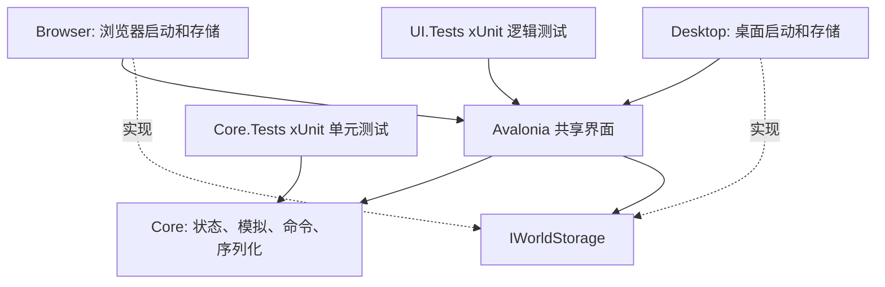

# SeWZC.WorldBox 架构

本页描述当前状态、模块与工程边界。玩家行为见 [产品约定](product.md)，修改规则见 [开发约定](development.md)，取舍见 [决策记录](decisions/README.md)。版本和数值须与链接中的实现一起更新，不保留旧格式分节。

## 依赖与状态流

Core 不引用 Avalonia、平台 API 或文件系统。UI 协调模拟、编辑、呈现和保存，平台入口实现 `IWorldStorage`。浏览器模拟及界面使用单线程 WebAssembly，普通 JavaScript Worker 仅用于保存。原生大群体先按固定顺序结算随机事件、公共补给与取水，再顺序转换整批个人身体的不可变输入，避免每 tick 的线程调度，按居民顺序提交结果。

模拟按完整离散日推进，呈现时钟在真实移动起终点间插值。慢设备限制实际推进速度，不跳过劳动、运输、通信或生存步骤。暂停冻结显示，变速重锚时间，载入和编辑传送重置轨迹；命中、标记、选中圈和跟随共用显示位置。短暂动作通知只说明已执行结果，不保存为世界事实或分配实体 ID。

## 状态归属

| 状态 | 权威来源与边界 |
| --- | --- |
| 世界事实 | [WorldState](../src/SeWZC.WorldBox.Core/WorldState.cs) 的固定地格、稳定 ID 实体、时间和随机状态 |
| 居民认知 | [AgentState](../src/SeWZC.WorldBox.Core/AgentState.cs) 的目标、记忆、人格、已接受的工作地点及经历；信息快照不可变，传播时保留来源及时效 |
| 制度材料 | [SocietyState](../src/SeWZC.WorldBox.Core/SocietyState.cs) 的 `Reports`；不读取未传达的全国居民思想 |
| 资源 | 聚落 `Resources`、个人 `Inventory` 及军队补给分别记账；国家总量是聚合展示 |
| 身份与归属 | 种族、文化、国家及聚落各自稳定 ID；转移通过统一命令维护首都和关联实体 |
| 领地与等级 | `Tile.ClaimedSettlementId` 和 `NationId` 登记，中心是连通根；`Settlement.Tier` 保存村镇城，建筑 `Level` 独立 |
| 研究与规则 | [Advancement](../src/SeWZC.WorldBox.Core/Advancement.cs) 及其 [目录](../src/SeWZC.WorldBox.Core/Advancement.Catalog.cs) 统一知识图、费用和解锁，前置直接引用研究对象；[ResearchRules](../src/SeWZC.WorldBox.Core/ResearchRules.cs) 负责路线与解锁索引，[ProductionRules](../src/SeWZC.WorldBox.Core/ProductionRules.cs) 定义生产配方 |
| 文明结果 | `GetCivilizationProgress` 从知识、可运作设施和首批生产派生，不作为研究或奖励保存 |
| 战争与故事 | 军队现场状态、机构已收军事报告、独立事件和真实经历分开；历史引用允许记录淘汰但不指向未来或形成循环 |
| UI 会话 | 镜头、选择、跟随、关注、折叠、导航、研究视野和短暂效果不进入模拟存档 |

实体、枚举和跨文件结果类型放各自同名文件，机制使用分部文件。世界、实体及其嵌套集合使用不可变类型，`WorldEngine.State` 返回可独立保留的快照；引擎内的稳定定位引用和派生缓存不进入状态或存档，定位引用不隐式转换为世界或实体；国家、军队及建筑的只读查询接收不可变值，转换结果显式提交到所属集合；居民日常字段以不可变值暂存，移动字段一次转换，低频实体字段与仓库库存显式提交；世界快照冻结所有已建立的集合并同步派生索引；日内地格、居民和聚落集合使用局部可变构建器，批次内每个触及分支只复制一次，成员增删即时更新内部顺序，在读取快照、整批转换或退出模拟 tick时冻结并合并发布，相邻更新按实际依赖合并为状态转换。撤销直接保留旧快照，恢复时校验状态并重建派生索引。居民认知、科研、政策、制度、文化接触、外交、冲突、军事及事件直接读取不可变值，内部列表不附带写入回调；状态转换返回新值并由调用方显式提交；居民编辑只从输入快照计算候选居民及下一编号，校验后统一提交。居民身份、职业、经历及免疫、战斗和死亡信息共享不可变记录，只在相应事件发生时复制；认知中的性格配置随低频信息共享，内部集合直接遍历使用值类型枚举器；初始化先构造完整实体，集合和初始种群在局部构建后统一提交；到场补给后，抵达熟路记录、基础生命过程与每日需求返回字段结果，与后续动作在快照边界合并产生新的居民状态；短记忆使用不可变数组，整批实体转换只复制有变化的分支；持久化实体序列连续替换同一叶分支时共享上层树，叶分支内保留当前版本的差异，切换分支时合并差异，读取不串接历史版本。地图尺寸、种子与稳定编号只在初始化时设置；信息议题的时效、记忆替换、传递优先级与接收行为由共享多态对象决定。共享配方与实际库存分别建模：费用使用 `ResourceAmounts`，前置与解锁保存为只读集合，运行库存使用 `ResourceStock` 不可变值，粮水直接保存，其他资源共享不可变记录，日常粮水更新不复制其他资源，连续仓库补给只在结算函数内按居民顺序暂存，阶段结束显式提交；卸货和补给同时返回新的个人库存与仓库；扣费、导航、植被、种群及项目采样由旧值产生新值，调用方显式替换对应状态；显示标识不参与业务判断。地图工具使用 `MapTool`／`ToolCategory`，研究操作通过 `IResearchActionHandler` 调用界面命令，核心保持无 UI 依赖。

## 模块定位

下表文件名相对于 [Core](../src/SeWZC.WorldBox.Core/)、[UI](../src/SeWZC.WorldBox.UI/) 或 UI 的 [Controls](../src/SeWZC.WorldBox.UI/Controls/)；单元测试位于 [Core.Tests](../tests/SeWZC.WorldBox.Core.Tests/) 和 [UI.Tests](../tests/SeWZC.WorldBox.UI.Tests/)。表中列出相关的局部检查，不代表完整机制已覆盖；测试边界见 [单元测试说明](../tests/README.md)。

| 机制 | 主要文件 | 相关检查与缺口 |
| --- | --- | --- |
| 资源与费用 | Core `ResourceStock.cs`、`ResourceAmounts.cs` | `ResourceStockTests`、`ResourceAmountsTests` |
| 生成与种族 | Core `WorldEngine.Geography.cs`、`WorldEngine.WaterTerrain.cs`、`RaceTerrainRules.cs`、`WorldEngine.RacialBuildings.cs` | 尚无生成专项验收 |
| 行动与通信 | Core `WorldEngine.Agents.cs`、`WorldEngine.Communication.cs`、`WorldEngine.WorkQueries.cs` | 尚无完整行动与通信验收 |
| 制度与文化 | Core `WorldEngine.Society.cs`、`SocietyState.cs`、`CultureDefinition.cs` | 尚无制度与文化专项验收 |
| 发展与外交 | Core `WorldEngine.Development.cs`、`WorldEngine.DevelopmentDemand.cs`、`WorldEngine.Evolution.cs` | 尚无长程发展与外交验收 |
| 城镇与施工 | Core `WorldEngine.Towns.cs`、`WorldEngine.Claims.cs`、`WorldEngine.BuildingSites.cs`、`WorldEngine.Upgrades.cs`、`WorldEngine.Workforce.cs` | 尚无完整建设验收 |
| 地块与运输 | Core `WorldEngine.Land.cs`、`WorldEngine.Transport.cs`、`WorldEngine.Provisioning.cs`，`Tile.Land.cs`、`Tile.Provisioning.cs` | `TraversalTests`；完整运输需另验 |
| 生态与养殖 | Core `AnimalRules.cs`、`PlantCoverage.cs`、`WorldEngine.Ecology.cs`、`WorldEngine.Husbandry.cs`、`WorldEngine.SustainableHarvest.cs` | `PlantCoverageTests`；生态平衡与养殖需另验 |
| 生产与研究玩法 | Core `Advancement.Catalog.cs`、`ProductionRules.cs`、`WorldEngine.Advancement.cs`、`WorldEngine.ResearchGameplay.cs`、`WorldEngine.KnowledgeQueries.cs` | `AdvancementTests`、`ResearchActionTests`、`ResearchCommandsTests`、`ProductionTests`；完整演化需另验 |
| 战争与灾害 | Core `WorldEngine.Warfare.cs`、`WorldEngine.Campaigns.cs`、`WorldEngine.Conflicts.cs`、`WorldEngine.Fire.cs`、`WorldEngine.Mortality.cs` | `DamageProtectionTests`；战争与灾害需另验 |
| 观察与故事 | Core `WorldEngine.Inspection.cs`、`WorldEngine.EffectsInfo.cs`、`WorldEngine.TaskIcons.cs`、`WorldEngine.Presentation.cs`、`WorldEngine.Stories.cs`；UI `MainView.Stories.cs` | 尚无故事与实际呈现验收 |
| 编辑与存档 | Core `WorldEngine.Commands.cs`、`WorldEngine.ResidentEditing.cs`、`WorldEngine.NationEditing.cs`、`WorldEngine.Persistence.cs`、`WorldEngine.ValidationV2.cs`、`WorldJsonContext.cs` | `ResidentEditingTests`、`NationEditingTests`、`WorldPersistenceTests`、`WildlifeSerializationTests` |
| 详情与异步提交 | UI `MainView.Navigation.cs`、`MainView.AsyncEdits.cs`、`MainView.Inputs.cs`、`MainView.Residents.cs`、`MainView.Buildings.cs` | 真实控件与异步会话需另验 |
| 科技树 | UI `MainView.Research.cs`、`MainView.ResearchActions.cs`；Controls `ResearchTreeLayout.cs`、`ResearchGraphControl.cs` | `ResearchTreeLayoutTests`；拖动、缩放与触屏需另验 |
| 地图与输入 | Controls `WorldMapControl.*.cs`、`EntityMotionTrack.cs`；Browser `wwwroot/text-input.js`、`touch-gestures.js` | `EntityMotionTrackTests`；渲染与实际输入需另验 |
| 平台保存 | [BrowserWorldStorage](../src/SeWZC.WorldBox.Browser/BrowserWorldStorage.cs)、`storage.js`、`storage-worker.js`；[DesktopWorldStorage](../src/SeWZC.WorldBox.Desktop/DesktopWorldStorage.cs) | 实际导入导出及刷新恢复，尚无平台自动验收 |
| 发布与 CI | [发布脚本](../scripts/publish-browser.sh)、[静态检查](../scripts/check-static-site.py)、[工作流](../.github/workflows/build-and-deploy.yml) | 静态资源检查；启动与部署后交互需另验 |

## 派生缓存与预算

缓存不进入存档，不授予知识，也不消费随机数；载入、更换网格或相关输入变更后重新推导。新增状态修改路径须核对下列失效责任。

- **居民阶段**：工作分组、知识位索引、报告去重、文化接触位置、工位预约及生产预算只服务当前逻辑阶段，退出时清空引用；发展预留在本阶段首次实际查询时评估，后续取料仍核对实时库存；阶段内死亡、迁居、目标或知识变化同步维护。外部命令读取权威集合，不依赖上一步缓存。
- **通信与搜索**：复用地格人数、连续居民索引、候选和投递容器，按邻格人数直接定位接收者，保持消息顺序及独立事实副本；附近居民分区在位置不变的社会阶段复用于施法，阶段外、成员变化或通道倒塌后读取实时位置，退出模拟步清除引用。大群体按已保存的居民顺序错峰普通交谈，每 tick 约启动 32 次；普通观察以至少三十二 tick的周期错峰安排，大群体每 tick 约安排 32 人；非军队居民所在格起火时立即观察；持续缺粮或严重缺水的目标复评对齐个人四 tick 错峰，首次对齐间隔三至六 tick，初次紧急判断仍即时执行，正在有效采食或到充足水源补水时继续当前劳动，现场枯竭与新危险仍提前复评；消息中的事实合并记忆后提交居民状态。采集选择附近可达来源，取水比较实际供水、距离和自身记忆；供水和采集仍核对实际存量。居民局部选路复用有界优先队列，比较真实通行耗时；目标保存来自六格视野的至多六步短路线，后续抵达时逐步核对通行与火情，受阻、位置或交通方式改变后重新规划；单次搜索复用进入成本，以可行路线的成本上界剪枝，视野内目标按距离下界引导搜索；`AgentState.FamiliarTiles` 保存最近实际到访的有限地格，只影响本人偏好，不进入共享可达性缓存。
- **通行与领地**：`TerritoryCounts` 增量维护绑定地格的归属和通行修订及已登记地格；单个对象替换不能绕过通知。连通修复在归属未变时跳过，变化后仅检查已登记地格，导入独立校验。局部可达性按起点、种族、交通方式和通行修订缓存，日内道路完工、火情边界等立即失效，缓存有固定槽位而非随居民 ID 无界增长。
- **生态**：每 tick 最多复评 128 格，完整周期为 `max(6, ceil(地块数 / 128))` tick，植物每格每年错峰复评。区域从保存 tick 序推导，无待提交游标。当前区和相邻边界使用共同初态计算，捕食与迁移消耗真实存量。
- **容量与物种**：静态栖息容量按地形、植被、饱和资源、肥力、水、耕作、占地和灾害输入失效；实际猎物限制用当天快照，不能当作静态容量缓存。可食动物取实际数量至少 0.05 的候选中生物量最大者，种群变化立即失效，种群值位于 [Tile.Ecology.cs](../src/SeWZC.WorldBox.Core/Tile.Ecology.cs)，引擎按一次地格转换统一分类失效输入，独立的生态查询缓存只接收不可变地格，集合通知维护领地与通行索引。
- **绘图**：居民按快照建立空间分区，只查询可见区域和移动区段；过密人物按屏幕小格合并，命中仍保留全部居民。地格屏幕边长达到 32／48／64 像素时分别启用人物外观、生态图标和任务及建筑名称。地形块保留像素及图像输入，变化时重画脏格与邻格；聚落、水源、肥力和灾害高亮在全图复用分块位图，放大后填充可见地格。缓存按不可变输入失效，在实际绘制时合并刷新；分块只保留修订号，避免持有多日世界快照。动物容量和六类代表物种一次批算，生态指令按精确输入复用。高建筑、居民和舟船用复用列表按插值后底部 Y 排序，`BuildingBounds` 共用图形和命中边界。
- **调度**：1／2／5 倍分别使用 12／48／64 ms 软预算，每回调最多四个完整 tick，五倍最多八 tick 欠账；“不限制”不等待 tick 截止时间、不限制批次步数，使用 64 ms 软预算后让出界面线程并尽快继续。动画总览 15 Hz、普通近景 30 Hz、五倍及不限速近景 20 Hz。完整模拟步不可中断，频率和预算不保证实际绘制 FPS 或硬实时。

记录容量由模型与校验器共同约束。当前世界事件最多 400 条，居民记忆 16 条、决策 6 条、经历 24 条，亡者档案 256 位；按意义淘汰并保留历史引用，不宣称无限人生史。调整需同时核对保存大小和浏览器负载。

## 编辑与存档

### 当前格式

存档格式 **22**、模拟版本 **26**，权威定义见 [WorldState](../src/SeWZC.WorldBox.Core/WorldState.cs)，接受条件见 [持久化校验](../src/SeWZC.WorldBox.Core/WorldEngine.Persistence.cs)。alpha 明确拒绝旧版及未知格式，不迁移、不猜测缺失状态。已删除的帝国项目不保留空研究编号；旧贸易路线、请愿与聚落等级状态不再保存，现行贸易、报告及 `Tier` 使用各自实际路径。

JSON 使用源生成上下文，中文直接写入 UTF-8，仍转义 HTML 敏感字符；已明确以零初始化的战争、任务和导航空字段可省略，非零默认值和必需字段保留。保存种子、随机状态、时间、稳定 ID、关系及所有影响未来的途中状态。研究保存为 `Advancement.Id`，读取时恢复目录中的共享对象，不保存整份规则图。库存缺失金额及指定地格计数明确为零；带非零初始化器或必需语义的字段仍显式存在，不全局忽略默认值。存档中的居民信息按固定 18 字段数组保存，完整保留内容、来源、时刻、可信度及军事关联，编辑 JSON 仍使用字段名。附加动物按物种编号／精确数量交替保存，拒绝重复、未知、缺配对或非法数量。

导入先构造并完整校验候选状态，再替换世界，检查尺寸、容量、枚举、有限数值及实体关系。未压缩 UTF-8 上限 **64 MiB**，压缩读取也核对实际解压字节与申报大小。确定续演限同一程序版本、状态和操作序列，不承诺跨硬件、框架或版本浮点结果完全一致。

### 编辑与保存协调

`MainView.Navigation.cs` 保存最近 32 处 UI 历史，`MainView.AsyncEdits.cs` 将提交绑定原世界、窗口世代和导航会话。对象跳转先记录当前位置；窗口和地图取点仅临时停表。恢复点准备期间锁定原输入并可取消，失效任务不得修改新世界或关闭新窗口。

有效编辑先取得整轮世界快照，再提交并保持暂停；命令部分成功后报错仍保留撤销点，完全未变的失败恢复原运行偏好。继续模拟清除这一轮恢复点，历史记录编辑不回算客观世界。

`ExportJsonChunksAsync` 用 16 KiB 序列化缓冲与完整 UTF-8 码点产生有界文本块，前台约每 4 ms 让出执行权。捕获时固定世界 tick 序，镜头可用；编辑、撤销或换世界在修改前取消捕获并保留旧存档。自动保存不拼接整块字符串，文件导出与编辑恢复点仍有最终拼接开销。

UI 每 30 秒检查自动保存，世界实例、tick 序及编辑修订都未变时跳过；手动保存仍执行，失败保留待保存状态。编辑结束至少留 5 秒空闲后再捕获。捕获完毕恢复模拟，压缩与落盘期间继续，不追赶捕获停留或后台离线时间；完整写入成功才更新保存标记。

### 平台保存

浏览器逐块传输，用 `scheduler.yield`／MessageChannel 让出事件循环。`storage-worker.js` 压缩 Blob 并事务写入 IndexedDB，入口提供已解析的模块 URL。无 Worker 时在主线程写入，无压缩 API 时保存未压缩 Blob。读取校验 Blob 记录、流式解压并严格验证 UTF-8，失败不提交不完整捕获。

桌面后台检查大小、gzip 压缩、写同目录临时文件并原子替换。实际路径和玩家备份操作见 [操作与存档](gameplay.md#存档与兼容性)，核心取消测试与平台验收边界见 [单元测试说明](../tests/README.md)。

## 静态交付

[Browser 项目](../src/SeWZC.WorldBox.Browser/SeWZC.WorldBox.Browser.csproj) 的发布 `wwwroot` 是完整静态站点；脚本复制到 `artifacts/site`，生成提交标记、添加 `.nojekyll` 并检查资源和 WASM。自有资源用相对 URL，支持根目录和仓库子路径。

静态文件检查不能证明裁剪发布可启动，真实输入、IndexedDB 和导出文件仍须实际验证。CI 范围和 Pages 设置见 [部署指南](deployment.md#发布到-github-pages)。
